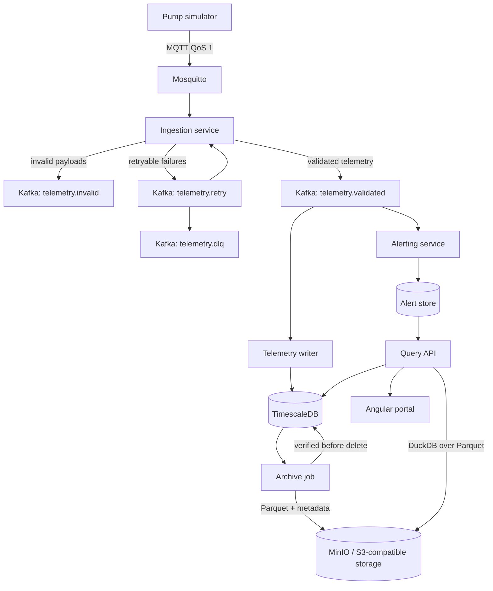

# Industrial IoT telemetry platform

> A public portfolio project about telemetry ingestion, Kafka delivery semantics, hot/cold storage, and safe archival.

> **Current repository status:** Phase 1 skeleton in progress: local infrastructure and application shells are being implemented.

## Overview

This project implements a small industrial IoT telemetry platform for simulated pump equipment. A pump simulator publishes measurements over MQTT, the backend validates and normalizes the data, Kafka carries validated events through the pipeline, TimescaleDB stores recent telemetry, and older data is archived as Parquet files in object storage. The query API hides the physical storage layout from clients by planning HOT, COLD, or HYBRID reads and merging the results into one chronological response.

The goal is not to build a full industrial product. The goal is to demonstrate the engineering problems that make telemetry systems interesting: at-least-once delivery, ordering, deduplication, consumer redelivery, verified archival before deletion, and transparent querying across storage tiers.

## Why this project exists

Most portfolio projects stop at CRUD. This one is about the parts of backend engineering that fail quietly if they are designed badly.

The project focuses on questions like:

- What happens when MQTT delivers the same message twice?
- How do Kafka partition keys affect ordering guarantees?
- When is it safe for a consumer to commit an offset?
- How do we prevent redelivery from creating duplicate database rows?
- How do we prove archived data is valid before deleting hot data?
- How should an API behave when part of a historical query lives in object storage?
- How do we document failure modes instead of pretending they do not exist?


## Architecture



Planned local development starts with Docker Compose. Kubernetes deployment with Helm and Argo CD comes later, after the local system works end to end.

## Core engineering problems

### Telemetry ingestion

The simulator emits pump telemetry such as temperature, pressure, vibration, rotational speed, and power consumption. The ingestion path validates schema versions, separates event time from ingestion time, normalizes units, carries correlation IDs, and rejects invalid measurements before they enter the regular telemetry path.

### Event streaming with Kafka

Validated telemetry is published to Kafka. The partition key is `tenantId:equipmentId`, so messages for the same equipment keep their relative ordering. Consumers commit offsets manually after successful processing. Redelivery is expected, so consumers must be idempotent.

The project includes retry and dead-letter topics for failed messages and exposes consumer lag as an operational metric.

### Hot storage with TimescaleDB

Recent raw telemetry is stored in TimescaleDB using event time as the primary time dimension. The database will use hypertables, continuous aggregates, compression, and configurable retention.

The important distinction is that `event_time`, `ingestion_time`, and `persisted_at` are all stored separately. In telemetry systems, those timestamps do not mean the same thing.

### Verified archival

Old telemetry is archived to Parquet files in an S3-compatible object store. Hot data is deleted only after verification succeeds.

Verification checks include:

- object exists
- object size is greater than zero
- Parquet file is readable
- exported row count matches the source range
- checksum matches

Archive jobs are modeled as a state machine so they can be retried and resumed safely. A failed archive must never damage already verified data, and a successful upload must not be treated as proof that deletion is safe.

### Hybrid query planning

The frontend does not choose between hot and cold storage. It asks the backend for telemetry over a time range, and the backend decides whether the request should be served from TimescaleDB, Parquet, or both.

The response includes source metadata so the UI can show whether the result came from HOT, COLD, or HYBRID storage. That badge is intentional. It makes the storage lifecycle visible without leaking storage decisions into the client.

## Planned scope

| Area          | Planned implementation                                                                                                                                       |
|---------------|--------------------------------------------------------------------------------------------------------------------------------------------------------------|
| Simulation    | Pump simulator with normal, degrading, and critical states; reproducible runs; duplicate, late, out-of-order, invalid, outage, and connection-loss scenarios |
| Ingestion     | MQTT consumption, schema validation, unit normalization, deduplication, event-time handling, correlation IDs                                                 |
| Streaming     | Kafka topics, partitioning by equipment, consumer groups, manual offset commits, retry topic, dead-letter topic                                              |
| Storage       | TimescaleDB hypertable, continuous aggregates, compression, retention                                                                                        |
| Alerting      | Threshold rules, time-window rules, hysteresis, severity levels, acknowledge/comment flow                                                                    |
| Archival      | Parquet export, object-store layout, checksum and row-count verification, resumable state machine, audited deletion                                          |
| Querying      | HOT/COLD/HYBRID planner, DuckDB over Parquet, partition pruning, server-side aggregation, source metadata                                                    |
| Frontend      | Equipment list, equipment detail, live values, historical chart, time range selector, source badge, alert center                                             |
| Platform      | Docker Compose first; Helm and Argo CD later                                                                                                                 |
| Observability | Structured logs, OpenTelemetry traces, Prometheus metrics, Grafana dashboards                                                                                |
| Documentation | README, architecture notes, ADRs, failure-mode document, runbook                                                                                             |

## Non-goals

This project deliberately does not implement the full product vision.

| Not built                                       | Reason                                                                                                                                  |
|-------------------------------------------------|-----------------------------------------------------------------------------------------------------------------------------------------|
| Apache Flink stream analytics                   | Kafka consumers are enough for the processing needed here. Flink would add operational weight without improving the core demonstration. |
| Machine-learning anomaly detection              | The main engineering problem is the data lifecycle. Statistical alerting is enough for this scope.                                      |
| Restore jobs                                    | Cold data remains queryable directly through Parquet and DuckDB. Rehydration is a later optimization.                                   |
| Full multi-tenant RBAC / Keycloak               | Tenant context is modeled in the data path, but identity-provider integration is outside the current scope.                             |
| Mobile applications                             | They do not add architectural value for this project.                                                                                   |
| Multi-region high availability                  | It cannot be demonstrated honestly in a small homelab setup.                                                                            |
| Schema Registry                                 | Schemas are versioned and validated in-process for now. A registry becomes useful when producers multiply.                              |
| Billing, ERP/SAP integration, equipment control | Outside the problem domain for this project.                                                                                            |

## Roadmap

Each phase should end with a runnable system and a tagged release. No phase should leave the repository in a half-finished state.

### Phase 1: skeleton

- Monorepo structure
- Docker Compose for local infrastructure
- Mosquitto
- TimescaleDB
- Spring Boot / Quarkus backend base
- Angular base project
- Pump simulator stub
- README v1

### Phase 2: telemetry path

- MQTT ingestion
- schema validation
- normalization
- deduplication
- TimescaleDB writes
- REST query API
- first chart in the UI

### Phase 3: Kafka

- Kafka between ingestion and writer
- partitioning by `tenantId:equipmentId`
- consumer groups
- manual offset commits
- retry topic and dead-letter topic
- consumer lag metric
- resilience tests for consumer death and rebalance behavior
- ADR for Kafka partitioning

### Phase 4: alerting

- threshold rules
- time-window rules
- hysteresis
- alert state model
- acknowledge/comment flow
- alert center in the UI
- live values through Server-Sent Events

### Phase 5: archival

- Parquet export
- MinIO object storage
- partitioned object layout
- checksum and row-count verification
- archive state machine
- safe deletion after verification
- failed-job retry
- deletion audit
- failure-mode documentation

Phase 5 is the first serious portfolio milestone. If this phase works well, the project is already worth showing.

### Phase 6: hybrid query

- DuckDB queries over Parquet
- partition pruning
- HOT/COLD/HYBRID planner
- chronological merge
- duplicate removal across sources
- source and completeness metadata
- source badge in the UI

### Phase 7: platform and observability

- Helm charts
- Argo CD deployment to RKE2
- OpenTelemetry tracing
- Prometheus metrics
- Grafana dashboards
- runbook

## Technology stack

| Layer             | Technology                                              |
|-------------------|---------------------------------------------------------|
| Backend           | Java, Spring Boot, Quarkus                              |
| Build             | Gradle                                                  |
| Frontend          | Angular                                                 |
| Messaging         | MQTT, Mosquitto, Apache Kafka                           |
| Hot storage       | TimescaleDB                                             |
| Cold storage      | MinIO, Apache Parquet                                   |
| Cold query engine | DuckDB                                                  |
| Local runtime     | Docker Compose                                          |
| Deployment        | Helm, Argo CD, Kubernetes (RKE2)                        |
| Observability     | OpenTelemetry, Prometheus, Grafana, structured logs     |
| Testing           | JUnit, Testcontainers, integration and resilience tests |

## Documentation

The documentation is part of the deliverable, not a cleanup task at the end.

Planned documents:

- `docs/architecture.md` — system architecture and data flow
- `docs/failure-modes.md` — expected behavior under delivery, storage, archival, and query failures
- `docs/runbook.md` — local operation and troubleshooting notes
- `docs/adr/` — architecture decision records

Planned ADRs:

- TimescaleDB as hot storage
- Parquet on object storage as cold tier
- Kafka partitioned by equipment ID
- Verify-then-delete archive state machine
- Query planner in the backend
- Modular monolith first, split later if needed

## Current status

Status: scoped for implementation.

The repository starts with the vision and implementation plan before the code is complete. Sections of this README describe planned behavior. As each phase lands, this file will be updated to distinguish implemented behavior from planned behavior.

The first implementation target is Phase 1: a local skeleton that starts with Docker Compose, exposes a backend health endpoint, runs an Angular shell, and includes the initial simulator structure.

## Running locally

Local run instructions will be added in Phase 1 once the skeleton exists.

Expected target command:

```bash
docker compose up
```

